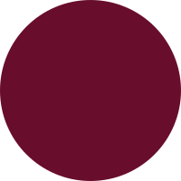

# Obround på Svenska

Kärt barn har många namn, men vad heter Obround på Svenska? Va? Vad heter vad? Vad är en Obround?

## Vad är en obround?

Enkla geometriska former vet vi vad det är, vi får lära oss allt om dem i skolan. De heter saker som cirkel, kvadrat och triangel. Små variationer i dessa ger oss nya former med andra namn, bland annat oval, ellips, rektangel och parallellogram.

En blandning av en kvadrat och en cirkel, en figur som har egenskaper från både kvadrat och cirkel, kallas för [kvirkel](https://sv.wikipedia.org/wiki/Kvirkel). På liknande sätt, om än inte speciellt matematiskt, är en engelsk obround en kombination av två enklare former, nämligen rektangel och cirkel, eller två halvcirklar.

kombineras med

och vi får

eller rättare sagt en obround:

Andra engelska namn på den är [stadium](Stadium), discorectangle och sausage body.

## Vad heter den på svenska då?

Ja du, vad jag vet finns det inget bra namn för en obround på svenska. Om man ska ta någon av de ovan och göra en direktöversättning så gillar jag **discorektangel** bäst. Lagom lättsamt och svängigt.

Formen påminner om en tablett eller ett piller, och många kallar det just **piller**, dock tycker jag piller är för hårt accosierat med vissa proportioner av figuren. Istället skulle jag vilja namnge det i analogi med kvirkeln, som en kombination av två former. Obrounden är en kombination av en rektangel och en cirkel, därför tycker jag det är lämpligt att kalla den för **"rektirkel"**.

## Bonus!

En variant på rektirkeln är kombinationen av en rektangel och en oval, man kan säga att den är lite utdragen i nån av axlarna. Den vill jag kalla **"rektval"**, med samma resonemang som ovan.

