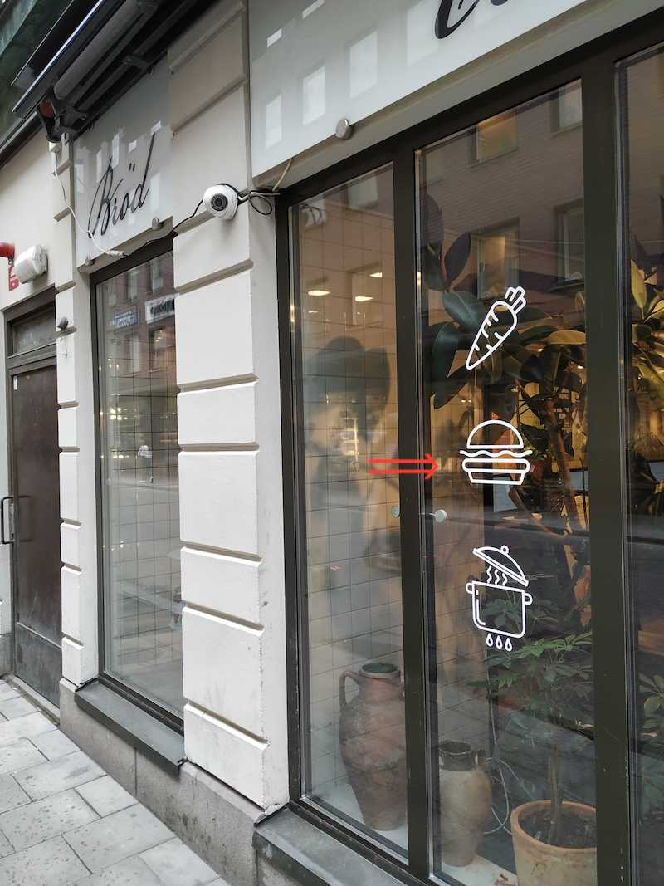
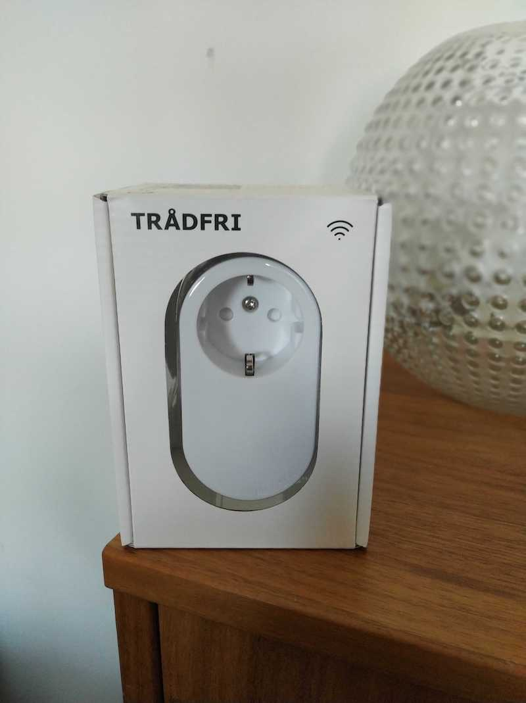

# Rektirkel i det vilda

Hur används rektirklar i verkligenheten, i det vilda? Här hittar du exempel på hur de används grafiskt inom design och andra områden:

**En hamburgare**

**En strömbrytare**

